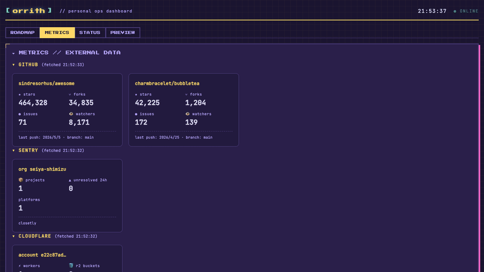

<div align="center">

# orrith

**The ops cockpit for solo builders.**

Bring your STATE / ROADMAP / TODO together with data sources like GitHub / Cloudflare / Sentry / Stripe — into a single HUD. Five aesthetic presets, dotfile-friendly, yours to shape.

[](https://www.npmjs.com/package/orrith)
[](LICENSE)
[](https://github.com/orrith/orrith)

> ⚠️ **Pre-release · WIP** — Not yet published to npm. `npx orrith` will not work until the first npm release. The code is here to read; install instructions become real after launch.



```bash
npx orrith
```

</div>

---

## Who is orrith for?

For any solo builder running a project of their own:

- Indie hackers running OSS / SaaS / side products by themselves
- Hobby hackers with personal projects (any size)
- IT day-jobbers building on the side
- dotfiles people (terminal customizers, "polish your own tools" types)

**Not for:** teams, companies, or business SaaS users. orrith is *your* tool.

---

## How you use it

Designed to live in a tab and stay there. Typical scenes:

- **Always-on dashboard** — keep it open in another tab, glance at it when something changes
- **Morning check** — start the day with "what shipped overnight / R2 usage now / Sentry errors"
- **Weekly retro** — open once a week to see "what grew this week"
- **Release / chart-on-demand** — show current numbers before/after a deploy, or paste a screenshot in your tweet/LP

---

## Why not existing tools?

| | Existing | What orrith adds |
|---|---|---|
| **Multi-source** | Cloudflare / Sentry / GitHub split into separate tabs | One panel for all of them |
| **Aesthetic switching** | SaaS dashboards have fixed UI | Five presets + extensible |
| **Ops + metrics together** | Linear (tasks) and Datadog (metrics) live apart | One screen for both |
| **Local-first** | SaaS-bound | Drop into your dotfiles, data stays local |

= Linear + Datadog + dotfiles + aesthetic-switching, fused into one.

---

## Quick Start

```bash
npx orrith init   # creates orrith.config.js + .env.example
npx orrith        # starts at http://localhost:3838
```

Open http://localhost:3838 in your browser. Use the preset dropdown in the footer to switch themes — your choice is remembered in `localStorage`.

---

## Configuration

### `orrith.config.js`

```js
export default {
  // Markdown ops sources (all optional; omit to hide that tab)
  sources: {
    state: 'STATE.md',
    backlog: 'backlog.md',
    roadmaps: 'roadmaps.md',
    todosDir: 'todos',
  },

  // Section names orrith looks for in your STATE.md
  parsers: {
    state: {
      phaseSection: 'Current Phase',     // matches `## Current Phase`
      roadmapSection: 'Current Roadmap', // matches `## Current Roadmap`
    },
    backlog: {
      categoryRegex: '^##\\s+([A-Z])\\.\\s+([^\\n]+)',
    },
  },

  // External data sources (all optional)
  metrics: {
    github: {
      repos: ['your-org/your-repo'],
      // token from env GITHUB_TOKEN (optional, raises rate limit 60→5000/h)
    },
    cloudflare: {},  // accountId / apiToken from env
    sentry: {},      // orgSlug / authToken from env
    stripe: {},      // secretKey from env
  },

  preset: 'pixel', // pixel | visor | monolith | doodle | minimal
  port: 3838,
}
```

### `.env`

External tokens are read from environment variables (recommended over inline config):

```sh
GITHUB_TOKEN=ghp_...

CLOUDFLARE_ACCOUNT_ID=...
CLOUDFLARE_API_TOKEN=...

SENTRY_ORG=your-org-slug
SENTRY_TOKEN=sntrys_...

STRIPE_SECRET_KEY=rk_live_...   # restricted key with read access
```

---

## Presets

| Preset | Vibe |
|---|---|
| **Pixel** | 8-bit retro · Press Start 2P · pink shadow |
| **Visor** | HMD cockpit · cyber · cyan accent |
| **Monolith** | quiet · monospace · zero ornament |
| **Doodle** | handwritten notebook · cream paper · ruled lines |
| **Minimal** | whitespace-led · Inter · modern simple |

Switch via the footer dropdown (saved in `localStorage`). Set the initial value with `preset` in config.

### Community presets

Made an aesthetic of your own? Drop it in [`presets/`](presets/) and open a PR. See [`presets/README.md`](presets/README.md) for the contribution guide. Share works-in-progress in [GitHub Discussions](https://github.com/orrith/orrith/discussions) → "Show your HUD".

---

## Data Sources

### GitHub

```js
metrics.github = { repos: ['owner/repo', ...] }
```

Per repo: **stars / forks / open issues / watchers / last push / default branch**.
With `GITHUB_TOKEN` set, rate limit goes from `60/h → 5000/h`.

### Cloudflare

```js
metrics.cloudflare = {} // env: CLOUDFLARE_ACCOUNT_ID + CLOUDFLARE_API_TOKEN
```

Required token permissions:
- `Account > Workers Scripts > Read`
- `Account > D1 > Read`
- `Account > R2 > Read`

Lists Workers / R2 buckets / D1 databases.

### Sentry

```js
metrics.sentry = {} // env: SENTRY_ORG + SENTRY_TOKEN
```

Auth Token scopes: `org:read`, `project:read`, `event:read`

Shows project count / 24h unresolved issues / platforms.

### Stripe

```js
metrics.stripe = {} // env: STRIPE_SECRET_KEY
```

Restricted Key with read access to: Balance / Charges / Subscriptions

Shows active subs / 24h charges / 24h revenue / available + pending balance.

---

## Extending: Custom Adapters

Built-in adapters (GitHub / Cloudflare / Sentry / Stripe) cover one common stack — **but not yours**, probably. Add any data source via **custom adapters** in `orrith.config.js`.

Examples: Vercel · Netlify · Fly.io · Supabase · Plausible · Lemon Squeezy · npm download stats · Crates.io · your internal API.

### Adapter contract

```ts
interface CustomAdapter {
  name: string                            // unique id, lowercase
  label: string                           // display name (uppercase)
  fetch: () => Promise<CustomMetricsResult>
}

interface CustomMetricsResult {
  fields: Array<{
    label: string                         // cell label (e.g. "stars")
    value: string | number                // cell value
    sub?: string                          // optional sub-text
  }>
  meta?: string                           // optional footer text
  fetchedAt: string                       // ISO timestamp
  error?: string                          // if set, card renders in error style
}
```

### Example: Vercel

```js
// orrith.config.js
export default {
  metrics: {
    custom: [
      {
        name: 'vercel',
        label: 'VERCEL',
        fetch: async () => {
          const res = await fetch('https://api.vercel.com/v9/projects', {
            headers: { Authorization: `Bearer ${process.env.VERCEL_TOKEN}` },
          })
          const data = await res.json()
          return {
            fields: [
              { label: 'projects', value: data.projects?.length ?? 0 },
            ],
            fetchedAt: new Date().toISOString(),
          }
        },
      },
    ],
  },
}
```

### Example: npm downloads (no auth needed)

```js
{
  name: 'npm-downloads',
  label: 'NPM',
  fetch: async () => {
    const pkg = 'orrith'  // your package
    const res = await fetch(`https://api.npmjs.org/downloads/point/last-week/${pkg}`)
    const data = await res.json()
    return {
      fields: [
        { label: 'last 7d', value: data.downloads.toLocaleString() },
      ],
      meta: `package: ${pkg}`,
      fetchedAt: new Date().toISOString(),
    }
  },
}
```

> **Have a great adapter?** Open a PR or share it in [GitHub Discussions](https://github.com/orrith/orrith/discussions) → "Show your HUD". Community-contributed adapters may graduate into built-ins.

> **Why aren't more built-ins shipped?** Built-ins lean on the author's stack (Cloudflare / Sentry) so we can dogfood with real data. The custom adapter API is the **stable extension surface** — write your own, share with others, and we'll cherry-pick the most-used ones into core over time.

---

## Tabs

- **ROADMAP** — each `## ` heading in `roadmaps.md` becomes one roadmap card. First card open by default.
- **METRICS** — the four data sources above
- **STATUS** — `git status` (branch / ahead / behind / modified / untracked)
- **PREVIEW** — internal browser (iframe any URL · viewport switching · history saved in localStorage)

---

## Roadmap

- [x] Step 0: Naming + repo bootstrap
- [x] Step 1: Core extraction + Pixel preset
- [x] Step 2: Remaining 4 presets (Visor / Monolith / Doodle / Minimal) + switching UI
- [x] Step 3: Data source integration (GitHub / Cloudflare / Sentry / Stripe)
- [x] Step 4: LP + README + demo gif
- [ ] Step 4.5: Custom adapter hook + alternative built-ins
- [ ] Step 5: 1st release + distribution (npm publish / Show HN / dotfiles channels)
- [ ] Step 6: Observe + iterate

---

## Stack

- Node 22+ (`--experimental-strip-types` runs TS directly)
- Express 5
- Vanilla JS + CSS (no build step; `public/` is served as-is)
- SSE for live file-watch updates

---

## Security

orrith is a **personal local-first tool**. It binds to `127.0.0.1` and does not accept connections from outside your machine. To keep it safe:

- **Don't expose it via ngrok / Tailscale / 0.0.0.0**. Tokens stored as env vars (`GITHUB_TOKEN`, `CLOUDFLARE_API_TOKEN`, `SENTRY_TOKEN`, `STRIPE_SECRET_KEY`) are sent to upstream APIs from your machine. If you tunnel orrith publicly, anyone on the tunnel can hit `/api/metrics` and see service info.
- **Run `npx orrith` only inside repos you trust.** orrith reads `orrith.config.js` at startup via dynamic import, which means the config file's code runs in your Node process. A malicious config can do anything your shell can. (Same caveat as `eslint.config.js`, `vite.config.ts`, and other JS-config tools.)
- **Use restricted/scoped tokens** for built-in adapters:
  - GitHub: PAT with `public_repo` only (or none — public API works at lower rate limits)
  - Cloudflare: token with **read-only** Workers/D1/R2 scopes
  - Sentry: scopes `org:read`, `project:read`, `event:read`
  - Stripe: **Restricted Key** with read access only to Balance / Charges / Subscriptions

## Reporting a vulnerability

Please email security reports privately to `seiya9shimizu@gmail.com` rather than opening a public issue.

---

## License

[MIT](LICENSE)

---

## Why "orrith"?

A coined word from `orrery` (the mechanical model that orbits multiple planets on a single plate) plus `-ith`. The metaphor: many indicators rotating on one HUD.
